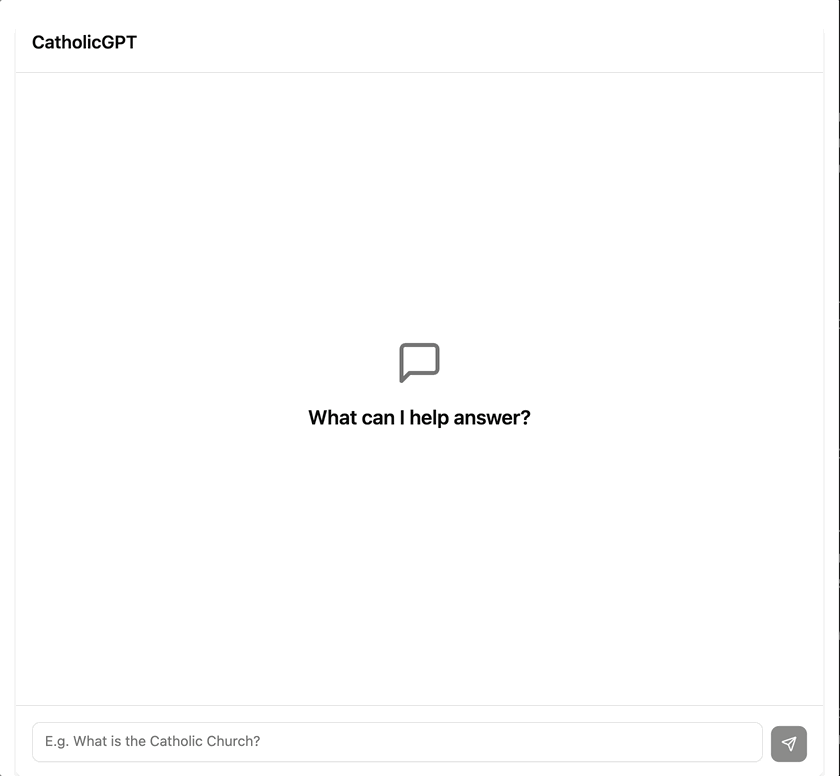

# Catholic GPT

## Project Overview  



**Catholic GPT** is a full-stack web application designed to help lay Catholics deepen their understanding of the faith **through AI-powered conversations**. There's a current state and the future vision for this project, which will be helpful in understanding this project.

### Current State and Features

As of this writing, 3/5/2025, this project is currently in "MVP"/beta version state. Thus, you'll notice that the application is lean right now.

The application has the current features:

- **Anonymous Sessions** — No user accounts are required. Each visitor gets a temporary anonymous user ID stored locally to tie conversations and messages together in the backend. When you leave the page, your chat session ends, and a new one begins upon return.
- **AI-powered Catholic Apologetics Chat** — Ask questions about Catholic doctrine, Church history, moral teachings, and more. Responses are crafted to align with Catholic teachings, citing sources like the Catechism, Scripture, and writings of the Church Fathers.
- **Modern Web App** — Fast, responsive UI with clean design and intuitive experience.

The application is currently in **closed beta** to ensure we get the most useful feedback. This will impact the roadmap moving forward.

### Vision

The vision for this project is to build an AI assistant that can be trusted and is the most accurate when it comes to answering questions and objections to the Catholic faith.

While many AI tools offer generalized responses and responses based off of a general data set, **Catholic GPT** will be fine tuned to answer questions about the faith.

There are two main ways **Catholic GPT** will seek to become more precise:

1. Fine tuning - Both RAG and general fine tuning of the model
2. Moderating by knowledgable Catholics - Volunteers will moderate the model's answers

As you'll see, OpenAI is currently used, and it is not optimal. This is currently used to move faster. This allows CatholicGPT to "go to market" ASAP, while having some level of accuracy (it's actually not bad already). Prompt engineering is utilized here to ensure accuracy.

Ultimately, the vision will continue to evolve as we go on, but moving towards more accuracy and trustworthiness is the vision.

## Roadmap

_Note: Given that we are in the early phases of this project (closed beta), this will continue to evolve. Thus, you'll see it only records two phases as of now, with more to come._

* ~~Phase 1 - This is the initial launch phase. The job here is to have a usable product that is deployed and can be put into users' hands -- in other words, the MVP.~~
* Phase 2 - Gather feedback is the main goal here. But, this will also include minor bug fixes in the `frontend` and a key enhancement that make it easier to get feedback. The key enhancement is allowing the user to rate the answer as useful or not.

## Tech Stack  

- **Frontend:** React, Vite, Tailwind CSS, Shadcn  
- **Backend:** NestJS, PostgreSQL  
- **AI Integration:** OpenAI API (currently using prompt engineering, with future plans for Catholic-specific fine-tuning)  
- **Language:** TypeScript (full stack)

## Directory Structure  

```
/frontend   # Frontend React app (UI)
/backend    # Backend NestJS API (handles chat logic, storage, AI calls)
```

## Contributing  

We are currently working on opening up the `frontend` for contributions. More to come soon.

## License  

This project is licensed under the **AGPL v3**.  
See [LICENSE](./LICENSE) for details.

## Acknowledgments & Motivation  

This project was born out of a desire to create a trustworthy, Catholic-centered AI resource for laypeople curious about their faith. Inspired by the rich intellectual tradition of the Church, **Catholic GPT** seeks to make apologetics more accessible through modern technology.

## Contact  

For questions, feedback, or future collaboration, feel free to reach out on [Discord](https://discord.gg/bAmCr5gu).
